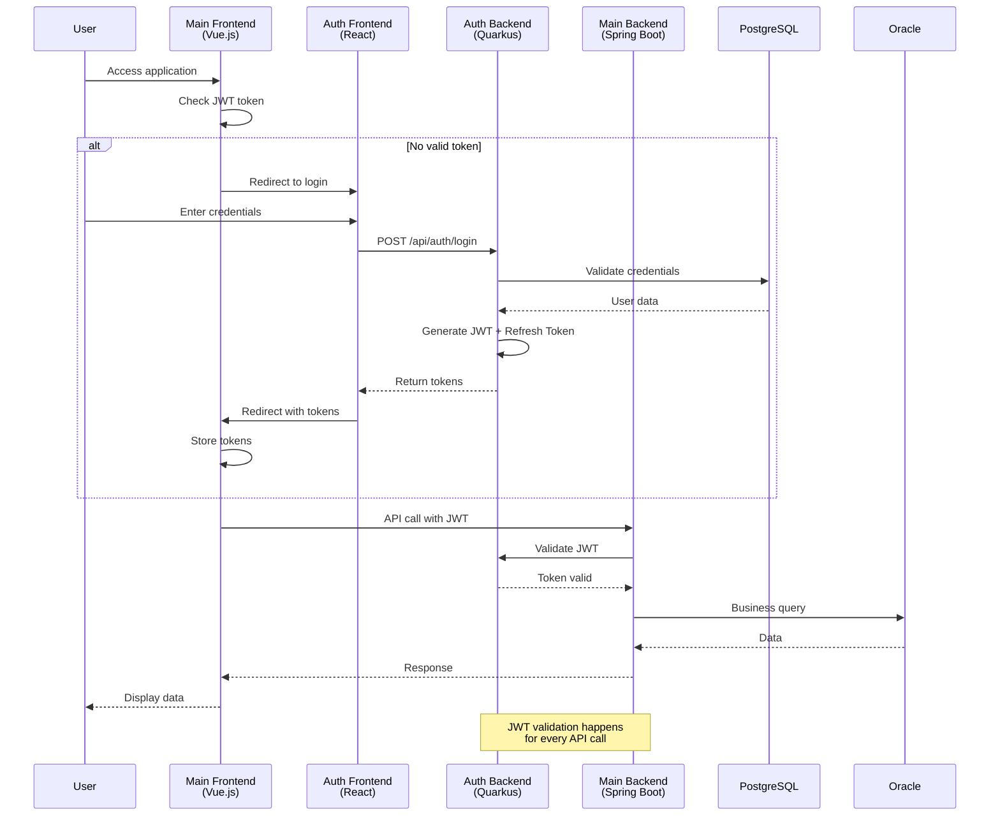
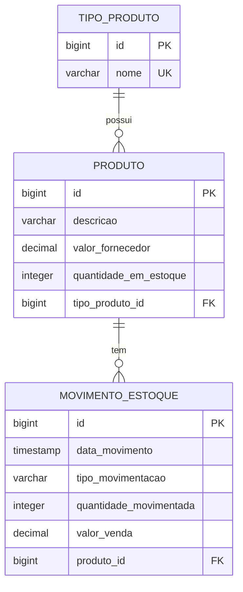

# VORTEX - Sistema de Controle de Estoque

<div align="center">
  <h1>🏢 VORTEX</h1>
  <p><strong>Sistema de Controle de Estoque FullStack</strong></p>
  <p>Uma aplicação completa para gerenciamento de estoque com controle de entradas, saídas e relatórios gerenciais</p>
</div>

---

## 📋 Índice

- [Sobre o Projeto](#-sobre-o-projeto)
- [Arquitetura do Sistema](#-arquitetura-do-sistema)
- [Tecnologias Utilizadas](#-tecnologias-utilizadas)
- [Funcionalidades](#-funcionalidades)
- [Modelo de Dados](#-modelo-de-dados)
- [API REST](#-api-rest)
- [Como Executar](#-como-executar)
- [Script de Inicialização](#-script-de-inicialização)
- [Estrutura do Projeto](#-estrutura-do-projeto)
- [Testes](#-testes)
- [Documentação da API](#-documentação-da-api)
- [Screenshots](#-screenshots)

---

## 🎯 Sobre o Projeto

O **VORTEX Sistema de Estoque** é um sistema completo de controle de estoque desenvolvido como parte de um desafio FullStack. A aplicação permite o gerenciamento completo de produtos, tipos de produtos, movimentações de estoque (entradas e saídas) e geração de relatórios gerenciais com análise de lucro.

### 🎨 Características Principais

- **Interface Moderna**: UI responsiva e intuitiva construída com Vue.js 3 e Vuetify
- **API RESTful**: Backend robusto com Spring Boot seguindo as melhores práticas REST
- **Controle de Estoque Automático**: Atualização automática do estoque em movimentações
- **Cálculo de Lucro**: Sistema automático de precificação com margem de 35%
- **Relatórios Gerenciais**: Visualização de dados com gráficos interativos
- **Documentação Completa**: API documentada com OpenAPI/Swagger

---

## 🏛 Arquitetura do Sistema

### Arquitetura de Microsserviços Completa

```mermaid
graph TB
    subgraph "Frontend Layer"
        AF[Auth Frontend<br/>React + TypeScript<br/>Port 3001] 
        MF[Main Frontend<br/>Vue.js 3 + TypeScript<br/>Port 5173]
        
        AF --> |Login/Register| AB
        MF --> |Business Operations| MB
        MF --> |Auth Check| AF
    end
    
    subgraph "Backend Layer"
        AB[Auth Backend<br/>Quarkus + Java 17<br/>Port 8081]
        MB[Main Backend<br/>Spring Boot + Java 24<br/>Port 8080]
        
        AB --> |JWT Validation| MB
        MB --> |User Info| AB
    end
    
    subgraph "Database Layer"
        PG[(PostgreSQL<br/>Auth Data<br/>Port 5433)]
        OR[(Oracle<br/>Business Data<br/>Port 1521)]
        H2[(H2<br/>Dev Database<br/>In-Memory)]
        
        AB --> PG
        MB --> OR
        MB -.-> H2
    end
    
    subgraph "Messaging Layer"
        KF[Kafka<br/>Port 9092]
        KUI[Kafka UI<br/>Port 8090]
        RMQ[RabbitMQ<br/>Port 5672/15672]
        
        MB --> KF
        MB --> RMQ
        KF --> KUI
    end
    
    subgraph "Infrastructure"
        NG[Nginx<br/>Reverse Proxy]
        DC[Docker Compose<br/>Orchestration]
        
        AF -.-> NG
        MF -.-> NG
        AB -.-> DC
        MB -.-> DC
    end
    
    style AF fill:#61dafb
    style MF fill:#42b883
    style AB fill:#4695eb
    style MB fill:#6db33f
    style PG fill:#336791
    style OR fill:#f80000
    style KF fill:#231f20
    style RMQ fill:#ff6600
```



### Fluxo de Autenticação



---

## 🚀 Tecnologias Utilizadas

### Backend Services

#### Main Application Service
- **Java 24** - Linguagem de programação principal
- **Spring Boot 3.5.3** - Framework para construção da API REST
- **Spring Data JPA** - Abstração para acesso a dados
- **Hibernate** - ORM para mapeamento objeto-relacional
- **Spring Security** - Segurança e autenticação JWT
- **Oracle Database** - Banco de dados principal
- **H2 Database** - Banco de dados em memória para testes
- **Lombok** - Redução de código boilerplate
- **SpringDoc OpenAPI** - Documentação automática da API
- **Maven** - Gerenciamento de dependências

#### Authorization Service
- **Java 17** - Linguagem de programação
- **Quarkus 3.8.5** - Framework supersônico e subatômico
- **Hibernate ORM with Panache** - ORM simplificado
- **SmallRye JWT** - Implementação JWT
- **PostgreSQL** - Banco de dados de autenticação
- **BCrypt** - Hash de senhas
- **Flyway** - Migração de banco de dados
- **SmallRye Health** - Health checks
- **Maven** - Gerenciamento de dependências

### Frontend Applications

#### Main Application
- **Vue.js 3** - Framework JavaScript progressivo
- **TypeScript** - Superset tipado do JavaScript
- **Vuetify 3** - Biblioteca de componentes Material Design
- **Vue Router** - Roteamento SPA com guards de autenticação
- **Pinia** - Gerenciamento de estado
- **Axios** - Cliente HTTP
- **Chart.js** - Visualização de dados em gráficos
- **VeeValidate + Yup** - Validação de formulários
- **Vite** - Build tool e dev server
- **Playwright** - Testes E2E
- **Vitest** - Testes unitários

#### Authorization Frontend
- **React 18** - Biblioteca JavaScript para interfaces
- **TypeScript** - Tipagem estática
- **React Router DOM** - Roteamento
- **React Hook Form** - Gerenciamento de formulários
- **Yup** - Validação de esquemas
- **TailwindCSS** - Framework CSS utilitário
- **Axios** - Cliente HTTP
- **React Hot Toast** - Notificações
- **Vite** - Build tool e dev server
- **Vitest** - Testes unitários

### Infrastructure & DevOps
- **Docker** - Containerização da aplicação
- **Docker Compose** - Orquestração de containers
- **Nginx** - Servidor web e reverse proxy
- **Apache Kafka** - Mensageria distribuída
- **RabbitMQ** - Message broker alternativo
- **Kafka UI** - Interface web para Kafka

---

## ⚡ Funcionalidades

### 📦 Gestão de Produtos
- Cadastro, edição e exclusão de produtos
- Definição de valor de fornecedor
- Controle automático de quantidade em estoque
- Associação com tipos de produtos

### 🏷️ Tipos de Produtos
- Criação de categorias para organização
- Gerenciamento completo de tipos
- Proteção contra exclusão com produtos vinculados

### 📊 Movimentações de Estoque
- **Entradas**: Aumentam o estoque disponível
- **Saídas**: Diminuem o estoque com validação de disponibilidade
- Cálculo automático do valor de venda (margem de 35%)
- Histórico completo de todas as movimentações
- Edição e exclusão com ajuste automático do estoque

### 📈 Relatórios Gerenciais
- **Produtos por Tipo**: Lista produtos agrupados por categoria com totais
- **Lucro por Produto**: Análise de rentabilidade com gráficos
  - Total de unidades vendidas
  - Lucro total por produto
  - Visualização em gráficos interativos

---

## 💾 Modelo de Dados



### 📝 Descrição das Entidades

#### TipoProduto
- Categorização dos produtos (ex: Eletrônicos, Vestuário, Alimentos)
- Nome único para evitar duplicações

#### Produto
- Informações básicas do produto
- Valor de fornecedor para cálculo de lucro
- Quantidade em estoque atualizada automaticamente

#### MovimentoEstoque
- Registro de todas as entradas e saídas
- Valor de venda calculado automaticamente para saídas
- Data/hora do movimento para rastreabilidade

---

## 🌐 API REST

### Endpoints Principais

#### Tipos de Produto
- `GET /api/tipos-produto` - Lista todos os tipos
- `POST /api/tipos-produto` - Cria novo tipo
- `GET /api/tipos-produto/{id}` - Busca tipo por ID
- `PUT /api/tipos-produto/{id}` - Atualiza tipo
- `DELETE /api/tipos-produto/{id}` - Remove tipo

#### Produtos
- `GET /api/produtos` - Lista todos os produtos
- `POST /api/produtos` - Cria novo produto
- `GET /api/produtos/{id}` - Busca produto por ID
- `PUT /api/produtos/{id}` - Atualiza produto
- `DELETE /api/produtos/{id}` - Remove produto

#### Movimentações
- `GET /api/movimentos` - Lista todas as movimentações
- `POST /api/movimentos` - Cria nova movimentação
- `GET /api/movimentos/{id}` - Busca movimentação por ID
- `PUT /api/movimentos/{id}` - Atualiza movimentação
- `DELETE /api/movimentos/{id}` - Remove movimentação

#### Relatórios
- `GET /api/relatorios/produtos-por-tipo?tipoProdutoId={id}` - Produtos por tipo
- `GET /api/relatorios/lucro-por-produto` - Análise de lucro

---

## 🏃 Como Executar

### Pré-requisitos
- **Obrigatórios**: Docker e Docker Compose
- **Opcionais para desenvolvimento**: 
  - Java 17+ e Maven 3.8+ (para desenvolvimento local)
  - Node.js 18+ e npm (para desenvolvimento local)

### 🚀 Execução Rápida (Recomendada)

1. Clone o repositório:
```bash
git clone https://github.com/caiocv18/vortex.git
cd vortex
```

2. Execute todos os serviços com o launcher:
```bash
# Inicia todos os serviços automaticamente
./start-vortex.sh

# Ou especifique o ambiente
./start-vortex.sh -e dev -m kafka
```

Isso iniciará:
- **Auth Backend**: Quarkus na porta 8081
- **Main Backend**: Spring Boot na porta 8080
- **Auth Frontend**: React na porta 3001
- **Main Frontend**: Vue.js na porta 5173
- **Infraestrutura**: Bancos de dados e mensageria

3. Acesse a aplicação:
- **Aplicação Principal**: http://localhost:5173
- **Serviço de Autenticação**: http://localhost:3001
- **API Principal**: http://localhost:8080/swagger-ui.html
- **API de Autenticação**: http://localhost:8081/q/swagger-ui

### 🐳 Execução com Docker (Produção)

```bash
# Ambiente de produção completo
./start-vortex.sh -e prd -m kafka

# Ou manualmente
cd infra/docker
docker-compose -f docker-compose.full-kafka.yml up -d
```

### 🔧 Desenvolvimento Local Manual

#### 1. Serviços de Autenticação
```bash
# Backend de autenticação
cd backend/vortex-authorization-service
mvn quarkus:dev

# Frontend de autenticação (nova janela de terminal)
cd frontend/vortex-authorization-service
npm install && npm run dev
```

#### 2. Aplicação Principal
```bash
# Backend principal
cd backend/vortex-application-service
./mvnw spring-boot:run

# Frontend principal (nova janela de terminal)
cd frontend/vortex-application-service
npm install && npm run dev
```

### 🛑 Parar Serviços
```bash
# Para todos os serviços
./start-vortex.sh --stop

# Ou manualmente
docker-compose down
pkill -f "spring-boot\|quarkus\|vite"
```

---

## 🚀 Script de Inicialização

Para uma experiência mais simples e automatizada, use o **Vortex Launcher** - um script inteligente que gerencia automaticamente todo o ambiente:

### Uso Rápido

```bash
# Modo interativo (recomendado)
./start-vortex.sh

# Ambiente de desenvolvimento (H2 + Hot Reload)
./start-vortex.sh -e dev

# Ambiente de produção (Oracle + Docker)
./start-vortex.sh -e prd

# Apenas backend
./start-vortex.sh -e dev --backend-only

# Parar todos os serviços
./start-vortex.sh --stop
```

### Características do Script

- **🔍 Detecção Automática**: Verifica pré-requisitos e adapta a execução
- **🌍 Múltiplos Ambientes**: Desenvolvimento (H2) ou Produção (Oracle)
- **🎨 Frontend Integrado**: Gerencia Vue.js automaticamente
- **🐳 Docker Inteligente**: Fallback para Docker quando ferramentas locais não estão disponíveis
- **📊 Monitoramento**: Status em tempo real dos serviços
- **🛑 Gerenciamento Completo**: Start, stop e limpeza de ambiente

### Ambientes Disponíveis

#### 🔧 Desenvolvimento (dev)
- Backend: Spring Boot local ou Docker
- Database: H2 em memória
- Frontend: Vite dev server (hot reload)
- URLs: API (8080), Frontend (5173), H2 Console

#### 🚀 Produção (prd)
- Backend: Docker + Spring Boot
- Database: Oracle Enterprise (Docker)
- Frontend: Build otimizado + Nginx
- URLs: API (8080), Frontend (3000), Oracle (1521)

Para documentação completa do script, consulte: [README-LAUNCHER.md](README-LAUNCHER.md)

---

## 📁 Estrutura do Projeto

```
vortex/
├── backend/                              # Serviços Backend
│   ├── vortex-application-service/       # Serviço Principal (Spring Boot)
│   │   ├── src/main/java/br/com/vortex/application/
│   │   │   ├── controller/               # REST Controllers
│   │   │   ├── service/                  # Lógica de negócio
│   │   │   ├── repository/               # Repositórios JPA
│   │   │   ├── model/                    # Entidades JPA
│   │   │   ├── dto/                      # Data Transfer Objects
│   │   │   ├── config/                   # Configurações (CORS, Security, Messaging)
│   │   │   ├── factory/                  # Message Broker Factory
│   │   │   └── exception/                # Exceções customizadas
│   │   ├── src/test/                     # Testes unitários e integração
│   │   ├── Dockerfile                    # Container Spring Boot
│   │   └── pom.xml                       # Dependências Maven
│   │
│   └── vortex-authorization-service/     # Serviço de Autenticação (Quarkus)
│       ├── src/main/java/br/com/vortex/authorization/
│       │   ├── resource/                 # JAX-RS Resources
│       │   ├── service/                  # Lógica de autenticação
│       │   ├── entity/                   # Entidades de usuário/auth
│       │   ├── dto/                      # DTOs de auth
│       │   ├── security/                 # JWT e criptografia
│       │   ├── event/                    # Eventos de autenticação
│       │   └── config/                   # Configurações Quarkus
│       ├── src/main/resources/db/migration/  # Migrações Flyway
│       ├── src/main/docker/              # Dockerfiles nativos
│       └── pom.xml                       # Dependências Maven
│
├── frontend/                             # Aplicações Frontend
│   ├── vortex-application-service/       # Frontend Principal (Vue.js)
│   │   ├── src/
│   │   │   ├── api/                      # Serviços de API
│   │   │   │   └── generated/            # Cliente gerado do OpenAPI
│   │   │   ├── views/                    # Páginas da aplicação
│   │   │   ├── components/               # Componentes Vue reutilizáveis
│   │   │   ├── stores/                   # Estado global (Pinia)
│   │   │   ├── router/                   # Configuração de rotas + guards
│   │   │   └── utils/                    # Utilitários (auth callback)
│   │   ├── e2e/                          # Testes E2E (Playwright)
│   │   ├── Dockerfile                    # Container Vue.js
│   │   └── package.json                  # Dependências npm
│   │
│   └── vortex-authorization-service/     # Frontend de Auth (React)
│       ├── src/
│       │   ├── pages/                    # Páginas de autenticação
│       │   ├── components/               # Componentes React
│       │   ├── contexts/                 # Context API (auth state)
│       │   ├── services/                 # Integração com API auth
│       │   └── types/                    # Tipos TypeScript
│       ├── Dockerfile                    # Container React
│       └── package.json                  # Dependências npm
│
├── infra/                               # Infraestrutura
│   ├── docker/                          # Configurações Docker Compose
│   │   ├── docker-compose.yml           # Stack básica
│   │   ├── docker-compose.full.yml      # Stack completa
│   │   ├── docker-compose.auth.yml      # Apenas auth services
│   │   └── docker-compose.full-kafka.yml # Com Kafka integrado
│   ├── kafka/                           # Configurações Kafka
│   ├── rabbitmq/                        # Configurações RabbitMQ
│   ├── oracle/                          # Scripts Oracle
│   └── docs/                            # Documentação de infraestrutura
│
├── docs/                                # Documentação Geral
│   ├── application/openapi-backend.json # Especificação OpenAPI
│   ├── authentication/README.md         # Documentação de auth
│   ├── PORTS.md                         # Mapeamento de portas
│   └── prompts/                         # Prompts de desenvolvimento
│
├── scripts/                             # Scripts utilitários
│   ├── check-ports.sh                   # Verificação de portas
│   └── test-queue-endpoint.sh           # Testes de messaging
│
├── start-vortex.sh                      # Launcher principal
├── CLAUDE.md                            # Instruções para Claude
├── README.md                            # Documentação principal
├── README-LAUNCHER.md                   # Documentação do launcher
└── KUBERNETES_GUIDE.md                  # Guia de deploy Kubernetes
```

---

## 🧪 Testes

### Backend Services

#### Main Application Service (Spring Boot)
- **Testes Unitários**: Controllers e Services
- **Testes de Integração**: API completa com banco H2
- **Execução**: 
  ```bash
  cd backend/vortex-application-service
  ./mvnw test
  ./mvnw test -Dtest=*ControllerTest  # Apenas controllers
  ```

#### Authorization Service (Quarkus)
- **Testes Especializados**: 98 testes focados em fluxos específicos
- **Registro de Usuário**: 42 testes (validação, criptografia, DTOs)
- **Recuperação de Senha**: 56 testes (service, security, validation)
- **Execução via Scripts**:
  ```bash
  # Testes de registro (42 testes)
  ./scripts/run-auth-registration-tests.sh --all
  ./scripts/run-auth-registration-tests.sh --coverage
  
  # Testes de recuperação de senha (56 testes)
  ./scripts/run-auth-password-recovery-tests.sh --all
  ./scripts/run-auth-password-recovery-tests.sh --security
  ```
- **Execução Maven**:
  ```bash
  cd backend/vortex-authorization-service
  mvn test
  mvn test -Dtest="*PasswordRecovery*"  # Apenas password recovery
  mvn test -Dtest=AuthResourceTest      # Teste específico
  ```

### Frontend Applications

#### Main Application (Vue.js)
- **Testes Unitários**: Componentes Vue com Vitest
- **Testes E2E**: Fluxos completos com Playwright
- **Execução**:
  ```bash
  cd frontend/vortex-application-service
  npm run test:unit     # Testes unitários
  npm run test:e2e      # Testes E2E
  npm run test:coverage # Coverage report
  ```

#### Authorization Frontend (React)
- **Testes Unitários**: Componentes React com Vitest
- **Testes de Integração**: Context e hooks
- **Execução**:
  ```bash
  cd frontend/vortex-authorization-service
  npm run test          # Testes unitários
  npm run test:coverage # Coverage report
  ```

### Execução de Todos os Testes
```bash
# Script para executar todos os testes
find . -name "pom.xml" -execdir mvn test \;
find . -name "package.json" -path "*/frontend/*" -execdir npm test \;
```

---

## 📚 Documentação da API

### Main Application Service (Spring Boot)
A documentação completa da API principal está disponível através do Swagger UI:

- **Interface Swagger**: http://localhost:8080/swagger-ui.html
- **Especificação OpenAPI**: http://localhost:8080/v3/api-docs
- **Health Check**: http://localhost:8080/health

### Authorization Service (Quarkus)
A documentação da API de autenticação está disponível através do Swagger UI do Quarkus:

- **Interface Swagger**: http://localhost:8081/q/swagger-ui
- **Especificação OpenAPI**: http://localhost:8081/q/openapi
- **Health Check**: http://localhost:8081/q/health
- **Métricas**: http://localhost:8081/q/metrics

### Arquivo OpenAPI
O arquivo de especificação OpenAPI da aplicação principal está disponível em:
- **Localização**: `docs/application/openapi-backend.json`
- **Uso**: Para geração de clientes API no frontend

---

## 🔐 Sistema de Autenticação

O Vortex inclui um sistema completo de autenticação e autorização baseado em microsserviços:

### Características de Segurança
- ✅ **JWT Tokens**: Autenticação stateless com tokens de acesso e refresh
- ✅ **Múltiplos Roles**: Sistema de papéis (ADMIN, USER, MANAGER, VIEWER)
- ✅ **Rate Limiting**: Proteção contra ataques de força bruta
- ✅ **Password Policy**: Política de senhas robusta
- ✅ **Audit Logs**: Registro completo de ações de autenticação
- ✅ **Token Refresh**: Renovação automática de tokens
- ✅ **CORS Configuration**: Configuração segura para comunicação entre services

### Usuários de Teste
O sistema inclui usuários pré-configurados para desenvolvimento:

| Email | Username | Password | Roles | Status |
|-------|----------|----------|-------|---------|
| admin@vortex.com | admin | Test@123 | ADMIN, USER | Ativo |
| user@vortex.com | user | Test@123 | USER | Ativo |
| manager@vortex.com | manager | Test@123 | MANAGER, USER | Ativo |
| viewer@vortex.com | viewer | Test@123 | VIEWER | Ativo |

### Fluxo de Autenticação Detalhado
1. **Acesso Inicial**: Usuário tenta acessar a aplicação principal
2. **Verificação de Token**: Router guard verifica presença e validade do JWT
3. **Redirecionamento**: Se não autenticado, redireciona para página de login
4. **Autenticação**: Usuário insere credenciais no frontend React
5. **Validação**: Backend Quarkus valida contra banco PostgreSQL
6. **Geração de Tokens**: Sistema gera JWT (15min) + Refresh Token (7 dias)
7. **Armazenamento**: Frontend armazena tokens de forma segura
8. **Autorização**: Cada requisição inclui JWT para validação
9. **Renovação**: Tokens são renovados automaticamente quando necessário

### Endpoints de Autenticação
- `POST /api/auth/login` - Login de usuário
- `POST /api/auth/register` - Registro de novo usuário
- `POST /api/auth/logout` - Logout e invalidação de tokens
- `POST /api/auth/refresh` - Renovação de tokens
- `POST /api/auth/forgot-password` - Solicitação de reset de senha
- `POST /api/auth/reset-password` - Reset de senha com token

---

## 🖼 Screenshots

### Dashboard Principal
Interface moderna com Material Design mostrando visão geral do sistema com estatísticas, produtos com baixo estoque e movimentos recentes.


### Gestão de Produtos
Tela completa para gerenciamento de produtos com filtros, ações de CRUD e controle de estoque em tempo real.


### Movimentações de Estoque
Controle detalhado de entradas e saídas com validações automáticas, cálculo de valores e histórico completo.


### Relatórios Gerenciais
Visualização de dados em gráficos interativos para tomada de decisão com análise de lucro e distribuição por categorias.


---

## 🤝 Contribuindo

Este projeto foi desenvolvido como parte de um desafio técnico. Para contribuições:

1. Faça um Fork do projeto
2. Crie uma branch para sua feature (`git checkout -b feature/AmazingFeature`)
3. Commit suas mudanças (`git commit -m 'Add some AmazingFeature'`)
4. Push para a branch (`git push origin feature/AmazingFeature`)
5. Abra um Pull Request

---

## 👥 Autor

**Caio Vinícius - Desenvolvedor FullStack** - Desafio Técnico Vortex

---

<div align="center">
  <p>Desenvolvido com ❤️ para o desafio Vortex</p>
</div> 