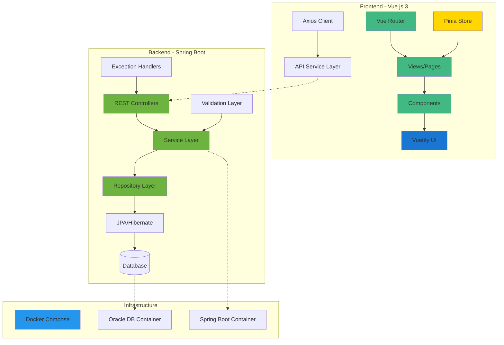
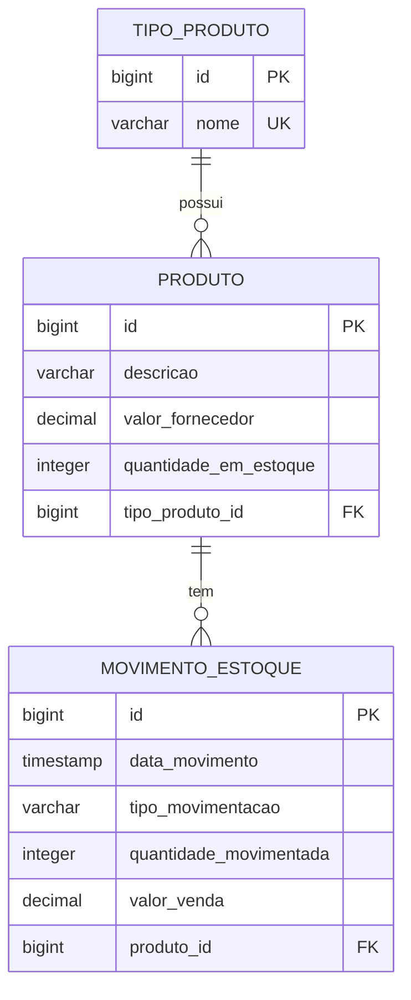

# NEXDOM - Sistema de Controle de Estoque

<div align="center">
  <h1>🏢 NEXDOM</h1>
  <p><strong>Sistema de Controle de Estoque FullStack</strong></p>
  <p>Uma aplicação completa para gerenciamento de estoque com controle de entradas, saídas e relatórios gerenciais</p>
</div>

---

## 📋 Índice

- [Sobre o Projeto](#-sobre-o-projeto)
- [Arquitetura do Sistema](#-arquitetura-do-sistema)
- [Tecnologias Utilizadas](#-tecnologias-utilizadas)
- [Funcionalidades](#-funcionalidades)
- [Modelo de Dados](#-modelo-de-dados)
- [API REST](#-api-rest)
- [Como Executar](#-como-executar)
- [Estrutura do Projeto](#-estrutura-do-projeto)
- [Testes](#-testes)
- [Documentação da API](#-documentação-da-api)
- [Screenshots](#-screenshots)

---

## 🎯 Sobre o Projeto

O **NEXDOM Sistema de Estoque** é um sistema completo de controle de estoque desenvolvido como parte de um desafio FullStack. A aplicação permite o gerenciamento completo de produtos, tipos de produtos, movimentações de estoque (entradas e saídas) e geração de relatórios gerenciais com análise de lucro.

### 🎨 Características Principais

- **Interface Moderna**: UI responsiva e intuitiva construída com Vue.js 3 e Vuetify
- **API RESTful**: Backend robusto com Spring Boot seguindo as melhores práticas REST
- **Controle de Estoque Automático**: Atualização automática do estoque em movimentações
- **Cálculo de Lucro**: Sistema automático de precificação com margem de 35%
- **Relatórios Gerenciais**: Visualização de dados com gráficos interativos
- **Documentação Completa**: API documentada com OpenAPI/Swagger

---

## 🏛 Arquitetura do Sistema



---

## 🚀 Tecnologias Utilizadas

### Backend
- **Java 24** - Linguagem de programação principal
- **Spring Boot 3.5.3** - Framework para construção da API REST
- **Spring Data JPA** - Abstração para acesso a dados
- **Hibernate** - ORM para mapeamento objeto-relacional
- **Oracle Database** - Banco de dados principal
- **H2 Database** - Banco de dados em memória para testes
- **Lombok** - Redução de código boilerplate
- **SpringDoc OpenAPI** - Documentação automática da API
- **Maven** - Gerenciamento de dependências
- **Docker** - Containerização da aplicação

### Frontend
- **Vue.js 3** - Framework JavaScript progressivo
- **TypeScript** - Superset tipado do JavaScript
- **Vuetify 3** - Biblioteca de componentes Material Design
- **Vue Router** - Roteamento SPA
- **Pinia** - Gerenciamento de estado
- **Axios** - Cliente HTTP
- **Chart.js** - Visualização de dados em gráficos
- **VeeValidate + Yup** - Validação de formulários
- **Vite** - Build tool e dev server
- **Playwright** - Testes E2E
- **Vitest** - Testes unitários

---

## ⚡ Funcionalidades

### 📦 Gestão de Produtos
- Cadastro, edição e exclusão de produtos
- Definição de valor de fornecedor
- Controle automático de quantidade em estoque
- Associação com tipos de produtos

### 🏷️ Tipos de Produtos
- Criação de categorias para organização
- Gerenciamento completo de tipos
- Proteção contra exclusão com produtos vinculados

### 📊 Movimentações de Estoque
- **Entradas**: Aumentam o estoque disponível
- **Saídas**: Diminuem o estoque com validação de disponibilidade
- Cálculo automático do valor de venda (margem de 35%)
- Histórico completo de todas as movimentações
- Edição e exclusão com ajuste automático do estoque

### 📈 Relatórios Gerenciais
- **Produtos por Tipo**: Lista produtos agrupados por categoria com totais
- **Lucro por Produto**: Análise de rentabilidade com gráficos
  - Total de unidades vendidas
  - Lucro total por produto
  - Visualização em gráficos interativos

---

## 💾 Modelo de Dados



### 📝 Descrição das Entidades

#### TipoProduto
- Categorização dos produtos (ex: Eletrônicos, Vestuário, Alimentos)
- Nome único para evitar duplicações

#### Produto
- Informações básicas do produto
- Valor de fornecedor para cálculo de lucro
- Quantidade em estoque atualizada automaticamente

#### MovimentoEstoque
- Registro de todas as entradas e saídas
- Valor de venda calculado automaticamente para saídas
- Data/hora do movimento para rastreabilidade

---

## 🌐 API REST

### Endpoints Principais

#### Tipos de Produto
- `GET /api/tipos-produto` - Lista todos os tipos
- `POST /api/tipos-produto` - Cria novo tipo
- `GET /api/tipos-produto/{id}` - Busca tipo por ID
- `PUT /api/tipos-produto/{id}` - Atualiza tipo
- `DELETE /api/tipos-produto/{id}` - Remove tipo

#### Produtos
- `GET /api/produtos` - Lista todos os produtos
- `POST /api/produtos` - Cria novo produto
- `GET /api/produtos/{id}` - Busca produto por ID
- `PUT /api/produtos/{id}` - Atualiza produto
- `DELETE /api/produtos/{id}` - Remove produto

#### Movimentações
- `GET /api/movimentos` - Lista todas as movimentações
- `POST /api/movimentos` - Cria nova movimentação
- `GET /api/movimentos/{id}` - Busca movimentação por ID
- `PUT /api/movimentos/{id}` - Atualiza movimentação
- `DELETE /api/movimentos/{id}` - Remove movimentação

#### Relatórios
- `GET /api/relatorios/produtos-por-tipo?tipoProdutoId={id}` - Produtos por tipo
- `GET /api/relatorios/lucro-por-produto` - Análise de lucro

---

## 🏃 Como Executar

### Pré-requisitos
- Docker e Docker Compose
- Java 24 (para desenvolvimento)
- Node.js 18+ (para desenvolvimento)
- Maven 3.8+ (para desenvolvimento)

### 🐳 Execução com Docker

1. Clone o repositório:
```bash
git clone https://github.com/seu-usuario/nexdom.git
cd nexdom
```

2. Execute com Docker Compose:
```bash
cd backend
docker-compose up -d
```

Isso iniciará:
- Oracle Database na porta 1521
- Backend Spring Boot na porta 8080

3. Inicie o frontend:
```bash
cd ../frontend
npm install
npm run dev
```

O frontend estará disponível em: http://localhost:5173

### 🔧 Desenvolvimento Local

#### Backend
```bash
cd backend
./mvnw spring-boot:run
```

#### Frontend
```bash
cd frontend
npm install
npm run dev
```

---

## 📁 Estrutura do Projeto

```
nexdom/
├── backend/                    # Aplicação Spring Boot
│   ├── src/
│   │   ├── main/
│   │   │   ├── java/
│   │   │   │   └── br/com/nexdom/desafio/backend/
│   │   │   │       ├── controller/     # REST Controllers
│   │   │   │       ├── dto/           # Data Transfer Objects
│   │   │   │       ├── exception/     # Exceções customizadas
│   │   │   │       ├── model/         # Entidades JPA
│   │   │   │       ├── repository/    # Repositórios JPA
│   │   │   │       └── service/       # Lógica de negócio
│   │   │   └── resources/
│   │   │       └── application.properties
│   │   └── test/              # Testes unitários e integração
│   ├── docker-compose.yml     # Orquestração de containers
│   ├── Dockerfile            # Imagem Docker do backend
│   └── pom.xml              # Dependências Maven
│
├── frontend/                 # Aplicação Vue.js
│   ├── src/
│   │   ├── api/             # Serviços de API
│   │   ├── assets/          # Recursos estáticos
│   │   ├── components/      # Componentes reutilizáveis
│   │   ├── router/          # Configuração de rotas
│   │   ├── stores/          # Estado global (Pinia)
│   │   └── views/           # Páginas da aplicação
│   ├── e2e/                 # Testes E2E
│   └── package.json         # Dependências npm
│
└── docs/                    # Documentação
    └── openapi-backend.json # Especificação OpenAPI
```

---

## 🧪 Testes

### Backend
- **Testes Unitários**: Controllers e Services
- **Testes de Integração**: API completa com banco H2
- Execução: `./mvnw test`

### Frontend
- **Testes Unitários**: Componentes Vue com Vitest
- **Testes E2E**: Fluxos completos com Playwright
- Execução: `npm run test:unit` e `npm run test:e2e`

---

## 📚 Documentação da API

A documentação completa da API está disponível através do Swagger UI:

- **Local**: http://localhost:8080/swagger-ui.html
- **Especificação OpenAPI**: http://localhost:8080/v3/api-docs

---

## 🖼 Screenshots

### Dashboard Principal
Interface moderna com Material Design mostrando visão geral do sistema

### Gestão de Produtos
Tela completa para gerenciamento de produtos com filtros e ações

### Movimentações de Estoque
Controle detalhado de entradas e saídas com validações

### Relatórios Gerenciais
Visualização de dados em gráficos interativos para tomada de decisão

---

## 🤝 Contribuindo

Este projeto foi desenvolvido como parte de um desafio técnico. Para contribuições:

1. Faça um Fork do projeto
2. Crie uma branch para sua feature (`git checkout -b feature/AmazingFeature`)
3. Commit suas mudanças (`git commit -m 'Add some AmazingFeature'`)
4. Push para a branch (`git push origin feature/AmazingFeature`)
5. Abra um Pull Request

---

## 📜 Licença

Este projeto está sob a licença Apache 2.0. Veja o arquivo [LICENSE](LICENSE) para mais detalhes.

---

## 👥 Autor

**Caio Vinícius - Desenvolvedor FullStack** - Desafio Técnico Nexdom

---

<div align="center">
  <p>Desenvolvido com ❤️ para o desafio Nexdom</p>
</div> 