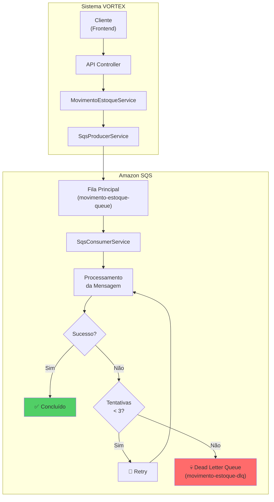

# Dead Letter Queue (DLQ) - Sistema VORTEX

## 📋 O que é Dead Letter Queue?

**Dead Letter Queue (DLQ)** é um conceito fundamental em sistemas de mensageria que atua como uma "fila de mensagens mortas" ou "fila de falhas". É um mecanismo de segurança que captura e isola mensagens que não puderam ser processadas com sucesso após um número determinado de tentativas.

### 🎯 Analogia Simples

Imagine o DLQ como um "hospital para mensagens doentes":
- Quando uma mensagem não consegue ser processada (está "doente")
- Ela é tentada algumas vezes (tratamento)
- Se não melhorar após várias tentativas, é enviada para um local especial (DLQ)
- Lá ela fica isolada para investigação posterior, sem afetar outras mensagens saudáveis

## 🏗️ Como o DLQ funciona no Sistema VORTEX

### Arquitetura do Sistema



### Filas DLQ Configuradas no Projeto

| Fila Principal | Dead Letter Queue | Propósito |
|---------------|-------------------|-----------|
| `vortex-movimento-estoque-queue` | `vortex-movimento-estoque-dlq` | Movimentações de estoque com falha |
| `vortex-notificacao-estoque-queue` | `vortex-notificacao-estoque-dlq` | Notificações que falharam |
| `vortex-auditoria-queue` | `vortex-auditoria-dlq` | Logs de auditoria com problema |

## 🚨 Quando uma Mensagem vai para o DLQ?

### 1. Erros Imediatos (Sem Retry)
```java
// Exemplo no SqsConsumerService.java
catch (EstoqueInsuficienteException e) {
    message.setMotivoErro("Estoque insuficiente: " + e.getMessage());
    enviarParaDLQ(message);  // ❌ Vai direto para DLQ
}

catch (ResourceNotFoundException e) {
    message.setMotivoErro("Produto não encontrado: " + e.getMessage());
    enviarParaDLQ(message);  // ❌ Vai direto para DLQ
}
```

**Por que não tenta novamente?**
- **Estoque Insuficiente**: Tentar novamente não resolve o problema
- **Produto Não Encontrado**: O produto realmente não existe no banco

### 2. Erros com Limite de Tentativas
```java
// Exemplo no SqsConsumerService.java
catch (Exception e) {
    // Incrementa contador de tentativas
    if (message.getTentativas() >= 3) {
        message.setMotivoErro("Número máximo de tentativas excedido: " + e.getMessage());
        enviarParaDLQ(message);  // ❌ Após 3 tentativas
    } else {
        throw new RuntimeException("Erro temporário", e);  // 🔄 Tenta novamente
    }
}
```

**Exemplos de erros temporários:**
- Falha de conexão com banco de dados
- Timeout de rede
- Indisponibilidade temporária de serviços

## 🔍 Cenários Práticos no Sistema VORTEX

### Cenário 1: Produto Inexistente
```json
{
  "operationId": "op-12345",
  "tipoMovimentacao": "SAIDA",
  "quantidadeMovimentada": 10,
  "produtoId": 999999,  // ❌ Produto não existe
  "tentativas": 1,
  "motivoErro": "Produto não encontrado: Produto com ID 999999 não foi encontrado"
}
```
**Resultado**: Vai direto para DLQ (não adianta tentar novamente)

### Cenário 2: Estoque Insuficiente
```json
{
  "operationId": "op-67890",
  "tipoMovimentacao": "SAIDA",
  "quantidadeMovimentada": 100,
  "produtoId": 1,
  "tentativas": 1,
  "motivoErro": "Estoque insuficiente: Tentativa de retirar 100 unidades mas só há 5 em estoque"
}
```
**Resultado**: Vai direto para DLQ (problema de negócio)

### Cenário 3: Erro de Sistema (com Retry)
```json
{
  "operationId": "op-11111",
  "tipoMovimentacao": "ENTRADA",
  "quantidadeMovimentada": 50,
  "produtoId": 1,
  "tentativas": 3,  // ❌ Máximo atingido
  "motivoErro": "Número máximo de tentativas excedido: Connection timeout"
}
```
**Resultado**: Vai para DLQ após 3 tentativas

## 🛠️ Implementação Técnica

### Configuração no application.properties
```properties
# Filas principais
sqs.queue.movimento-estoque=vortex-movimento-estoque-queue
sqs.queue.notificacao-estoque=vortex-notificacao-estoque-queue
sqs.queue.auditoria=vortex-auditoria-queue

# Dead Letter Queues
sqs.dlq.movimento-estoque=vortex-movimento-estoque-dlq
sqs.dlq.notificacao-estoque=vortex-notificacao-estoque-dlq
sqs.dlq.auditoria=vortex-auditoria-dlq
```

### Método de Envio para DLQ
```java
/**
 * Envia mensagem para Dead Letter Queue em caso de falha.
 */
private void enviarParaDLQ(MovimentoEstoqueMessageDTO message) {
    log.error("Enviando mensagem para DLQ. OperationId: {}, Motivo: {}", 
            message.getOperationId(), message.getMotivoErro());
    
    // Aqui você implementaria o envio para DLQ
    // Por simplicidade, apenas logamos o erro
    // Em produção, você enviaria para uma fila DLQ específica
}
```

### DTO com Informações de Erro
```java
public class MovimentoEstoqueMessageDTO {
    private String operationId;          // Para rastreamento
    private Integer tentativas = 0;      // Contador de tentativas
    private String motivoErro;           // Motivo da falha (para DLQ)
    // ... outros campos
}
```

## 🎯 Benefícios do DLQ no Sistema VORTEX

### 1. **Isolamento de Problemas**
- Mensagens com erro não bloqueiam o processamento de mensagens válidas
- Sistema continua funcionando mesmo com algumas falhas

### 2. **Rastreabilidade**
- Cada mensagem tem um `operationId` único
- Logs detalhados do motivo da falha
- Facilita debugging e correção de problemas

### 3. **Recuperação de Dados**
- Mensagens no DLQ não são perdidas
- Podem ser reprocessadas após correção do problema
- Evita perda de dados importantes

### 4. **Monitoramento**
- Permite identificar padrões de falha
- Alertas quando DLQ tem muitas mensagens
- Métricas de saúde do sistema

## 📊 Monitoramento e Alertas

### Métricas Importantes
- **Número de mensagens no DLQ**: Indica problemas no sistema
- **Taxa de erro por tipo**: Identifica problemas recorrentes
- **Tempo de permanência no DLQ**: Mensagens muito antigas precisam atenção

### Exemplos de Alertas
```bash
# Alerta quando DLQ tem mais de 10 mensagens
if (dlq_message_count > 10) {
    send_alert("DLQ com muitas mensagens - investigar problemas")
}

# Alerta para tipos específicos de erro
if (error_type == "EstoqueInsuficiente" && count > 5) {
    send_alert("Muitas tentativas de saída sem estoque - revisar processo")
}
```

## 🔧 Boas Práticas Implementadas

### 1. **Diferentes Estratégias por Tipo de Erro**
- Erros de negócio: Direto para DLQ
- Erros técnicos: Retry com limite

### 2. **Informações Detalhadas**
- Motivo específico do erro
- Número de tentativas
- Timestamp de cada tentativa

### 3. **Logs Estruturados**
```java
log.error("Enviando mensagem para DLQ. OperationId: {}, Motivo: {}", 
        message.getOperationId(), message.getMotivoErro());
```

## 🚀 Casos de Uso para Análise do DLQ

### 1. **Análise de Negócio**
- Identificar produtos com estoque frequentemente insuficiente
- Detectar tentativas de movimentação de produtos inexistentes
- Otimizar regras de estoque mínimo

### 2. **Análise Técnica**
- Identificar problemas de conectividade
- Detectar gargalos de performance
- Melhorar tratamento de erros

### 3. **Reprocessamento**
```java
// Exemplo de reprocessamento manual
public void reprocessarDLQ(String operationId) {
    // Buscar mensagem no DLQ
    // Corrigir problema identificado
    // Reenviar para fila principal
}
```

## 🎓 Resumo Executivo

**O DLQ no Sistema VORTEX é essencial porque:**

1. **Protege o Sistema**: Evita que mensagens problemáticas travem todo o processamento
2. **Preserva Dados**: Nenhuma informação é perdida, mesmo em caso de erro
3. **Facilita Debugging**: Cada erro é documentado com detalhes específicos
4. **Melhora Confiabilidade**: Sistema continua funcionando mesmo com falhas parciais
5. **Permite Recuperação**: Mensagens podem ser reprocessadas após correção

**Em termos simples**: O DLQ é como um "backup de segurança" que garante que nenhuma operação importante seja perdida, mesmo quando algo dá errado no sistema. 