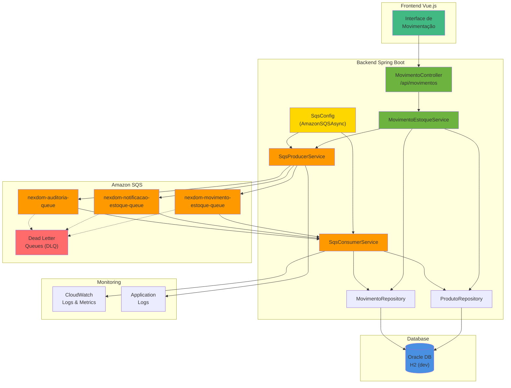

## 📋 Notas Técnicas

### Configuração SQS Assíncrona
- O sistema utiliza `AmazonSQSAsync` para melhor performance
- Configuração otimizada para processamento assíncrono
- Compatível com Spring Cloud AWS Messaging 2.2.6