```mermaid
graph TB
    subgraph "Frontend Vue.js"
        A["Interface de<br/>Movimentação"]
    end
    
    subgraph "Backend Spring Boot"
        B["MovimentoController<br/>/api/movimentos"]
        C["MovimentoEstoqueService"]
        D["SqsProducerService"]
        E["SqsConsumerService"]
        F["ProdutoRepository"]
        G["MovimentoRepository"]
        H1["SqsConfig<br/>(AmazonSQSAsync)"]
    end
    
    subgraph "Amazon SQS"
        H["nexdom-movimento-<br/>estoque-queue"]
        I["nexdom-notificacao-<br/>estoque-queue"]
        J["nexdom-auditoria-<br/>queue"]
        K["Dead Letter<br/>Queues (DLQ)"]
    end
    
    subgraph "Database"
        L[("Oracle DB<br/>H2 (dev)")]
    end
    
    subgraph "Monitoring"
        M["CloudWatch<br/>Logs & Metrics"]
        N["Application<br/>Logs"]
    end
    
    A --> B
    B --> C
    
    C --> D
    C --> F
    C --> G
    
    H1 --> D
    H1 --> E
    
    D --> H
    D --> I
    D --> J
    
    H --> E
    I --> E
    J --> E
    
    E --> F
    E --> G
    F --> L
    G --> L
    
    H -.-> K
    I -.-> K
    J -.-> K
    
    E --> M
    D --> N
    
    style A fill:#42b883
    style B fill:#6db33f
    style C fill:#6db33f
    style D fill:#ff9900
    style E fill:#ff9900
    style H1 fill:#ffd700
    style H fill:#ff9900
    style I fill:#ff9900
    style J fill:#ff9900
    style K fill:#ff6b6b
    style L fill:#4a90e2
```

## 📋 Notas Técnicas

### Configuração SQS Assíncrona
- O sistema utiliza `AmazonSQSAsync` para melhor performance
- Configuração otimizada para processamento assíncrono
- Compatível com Spring Cloud AWS Messaging 2.2.6