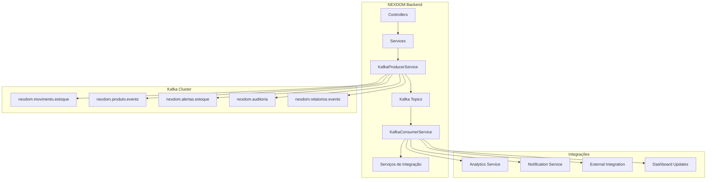

# Integração Apache Kafka - NEXDOM Sistema de Estoque

## 📋 Visão Geral

Este documento descreve a integração do sistema NEXDOM com Apache Kafka para processamento de eventos em tempo real, event sourcing e integração com sistemas externos.

## 🏗️ Arquitetura da Integração

### Fluxo de Eventos



## 🚀 Casos de Uso Implementados

### 1. **Event Sourcing para Movimentações de Estoque**

**Problema Resolvido**: Rastreabilidade completa de todas as operações de estoque

**Como Funciona**:
- Toda movimentação de estoque gera um evento no tópico `nexdom.movimento.estoque`
- Eventos contêm informações completas da operação (antes/depois)
- Permite reconstruir o estado do estoque em qualquer momento
- Facilita auditoria e compliance

**Exemplo de Evento**:
```json
{
  "eventId": "uuid-123",
  "timestamp": "2024-01-15T10:30:00",
  "eventType": "MOVIMENTO_ESTOQUE",
  "movimentoId": 123,
  "produtoId": 456,
  "tipoMovimentacao": "SAIDA",
  "quantidadeMovimentada": 10,
  "estoqueAnterior": 50,
  "estoqueAtual": 40,
  "lucro": 150.00
}
```

### 2. **Alertas de Estoque em Tempo Real**

**Problema Resolvido**: Detecção proativa de problemas de estoque

**Como Funciona**:
- Sistema monitora níveis de estoque após cada movimentação
- Gera alertas automáticos quando estoque fica baixo/esgotado
- Permite ações automáticas (pedidos de reposição, notificações)

**Tipos de Alerta**:
- `ESTOQUE_BAIXO`: Quantidade < 10 unidades
- `ESTOQUE_ESGOTADO`: Quantidade = 0
- `ESTOQUE_CRITICO`: Quantidade < 5 unidades

### 3. **Integração com Sistemas Externos**

**Problema Resolvido**: Sincronização automática com ERP, WMS e outros sistemas

**Como Funciona**:
- Eventos são consumidos por serviços de integração
- Sincronização automática com sistemas externos
- Criação automática de pedidos de reposição
- Atualização de catálogos de produtos

### 4. **Analytics e Dashboards em Tempo Real**

**Problema Resolvido**: Visibilidade imediata de métricas de negócio

**Como Funciona**:
- Processamento de eventos para cálculo de métricas
- Atualização de dashboards via WebSocket
- Geração de insights de negócio

## 🛠️ Como Usar

### Configuração Inicial

1. **Iniciar o Kafka**:
```bash
# Usando Docker Compose
docker-compose -f docker-compose.kafka.yml up -d

# Verificar se está funcionando
docker-compose -f docker-compose.kafka.yml ps
```

2. **Configurar o Application Properties**:
```properties
# Habilitar Kafka
kafka.enabled=true
spring.kafka.bootstrap-servers=localhost:9092

# Usar perfil específico do Kafka
spring.profiles.active=kafka
```

3. **Executar a Aplicação**:
```bash
./mvnw spring-boot:run -Dspring-boot.run.profiles=kafka
```

### Monitoramento

**Kafka UI**: http://localhost:8080
- Visualizar tópicos e mensagens
- Monitorar consumers e producers
- Verificar lag de consumo

**Métricas da Aplicação**: http://localhost:8081/actuator/metrics
- Métricas específicas do Kafka
- Health checks
- Informações de performance

### Testando a Integração

1. **Criar um Produto**:
```bash
curl -X POST http://localhost:8081/api/produtos \
  -H "Content-Type: application/json" \
  -d '{
    "descricao": "Produto Teste Kafka",
    "valorFornecedor": 10.00,
    "quantidadeEmEstoque": 100,
    "tipoProdutoId": 1
  }'
```

2. **Verificar Evento no Kafka UI**:
- Acessar http://localhost:8080
- Navegar para o tópico `nexdom.produto.events`
- Verificar se o evento foi publicado

3. **Fazer uma Movimentação**:
```bash
curl -X POST http://localhost:8081/api/movimentos \
  -H "Content-Type: application/json" \
  -d '{
    "produtoId": 1,
    "tipoMovimentacao": "SAIDA",
    "quantidadeMovimentada": 50
  }'
```

4. **Verificar Eventos Gerados**:
- Tópico `nexdom.movimento.estoque`: Evento da movimentação
- Tópico `nexdom.alertas.estoque`: Alerta se estoque ficou baixo

## 📊 Tópicos Kafka

| Tópico | Descrição | Partições | Retenção |
|--------|-----------|-----------|----------|
| `nexdom.movimento.estoque` | Eventos de movimentação | 3 | 7 dias |
| `nexdom.produto.events` | Eventos de produtos | 2 | 30 dias |
| `nexdom.alertas.estoque` | Alertas de estoque | 1 | 3 dias |
| `nexdom.auditoria` | Eventos de auditoria | 2 | 180 dias |
| `nexdom.relatorios.events` | Eventos de relatórios | 1 | 1 dia |

## 🔧 Cenários Avançados

### 1. **Processamento de Lotes com Kafka**

Para importar grandes volumes de dados:

```java
@Service
public class ImportacaoService {
    
    @Autowired
    private KafkaProducerService kafkaProducer;
    
    public void importarLoteMovimentos(List<MovimentoDTO> movimentos) {
        // Processar em lotes para melhor performance
        movimentos.parallelStream()
            .forEach(movimento -> {
                // Cada movimento gera evento no Kafka
                // Processamento assíncrono via consumers
                movimentoService.criar(movimento);
            });
    }
}
```

### 2. **Integração com Data Lake**

```java
@KafkaListener(topics = "nexdom.movimento.estoque")
public void enviarParaDataLake(MovimentoEstoqueEventDTO event) {
    // Enviar dados para S3, BigQuery, etc.
    dataLakeService.enviarEvento(event);
}
```

### 3. **Machine Learning em Tempo Real**

```java
@KafkaListener(topics = "nexdom.movimento.estoque")
public void processarML(MovimentoEstoqueEventDTO event) {
    // Alimentar modelos de ML para previsão de demanda
    mlService.processarMovimento(event);
    
    // Gerar recomendações de reposição
    if (mlService.shouldReorder(event.getProdutoId())) {
        recomendacaoService.gerarPedidoReposicao(event);
    }
}
```

### 4. **Kafka Streams para Agregações**

```java
@Component
public class EstoqueStreams {
    
    @Bean
    public KStream<String, MovimentoEstoqueEventDTO> processarMovimentos() {
        StreamsBuilder builder = new StreamsBuilder();
        
        KStream<String, MovimentoEstoqueEventDTO> movimentos = 
            builder.stream("nexdom.movimento.estoque");
            
        // Calcular métricas em tempo real
        movimentos
            .groupByKey()
            .windowedBy(TimeWindows.of(Duration.ofMinutes(5)))
            .aggregate(
                EstoqueMetrics::new,
                (key, movimento, metrics) -> metrics.add(movimento),
                Materialized.as("estoque-metrics-store")
            )
            .toStream()
            .to("nexdom.metricas.tempo-real");
            
        return movimentos;
    }
}
```

## 🔄 Comparação: Kafka vs SQS

| Aspecto | Kafka | SQS |
|---------|-------|-----|
| **Controle** | Total (self-hosted) | Gerenciado pela AWS |
| **Performance** | Muito alta | Alta |
| **Durabilidade** | Configurável | Até 14 dias |
| **Ordem** | Garantida por partição | FIFO limitado |
| **Replay** | Sim | Não |
| **Custo** | Infraestrutura própria | Pay-per-use |
| **Complexidade** | Maior | Menor |

## 📈 Benefícios da Integração

### Para o Negócio
- **Visibilidade em Tempo Real**: Dashboards atualizados instantaneamente
- **Proatividade**: Alertas automáticos de estoque
- **Integração**: Sincronização automática com sistemas externos
- **Auditoria**: Rastreabilidade completa de operações

### Para a Tecnologia
- **Escalabilidade**: Processamento distribuído de eventos
- **Resiliência**: Tolerância a falhas e reprocessamento
- **Flexibilidade**: Novos consumers sem impacto no sistema
- **Performance**: Processamento assíncrono de alta performance

## 🚦 Monitoramento e Alertas

### Métricas Importantes
- **Lag de Consumo**: Atraso no processamento de mensagens
- **Throughput**: Mensagens por segundo
- **Erro Rate**: Taxa de erros no processamento
- **Latência**: Tempo de processamento end-to-end

### Alertas Configurados
- Lag de consumo > 1000 mensagens
- Taxa de erro > 5%
- Latência > 30 segundos
- Espaço em disco Kafka > 80%

## 🔧 Troubleshooting

### Problemas Comuns

1. **Consumer Lag Alto**:
   - Aumentar número de partições
   - Aumentar paralelismo dos consumers
   - Otimizar processamento dos eventos

2. **Perda de Mensagens**:
   - Verificar configuração de `acks=all`
   - Verificar `enable.idempotence=true`
   - Revisar tratamento de exceções

3. **Duplicação de Mensagens**:
   - Implementar processamento idempotente
   - Verificar configuração de retry
   - Usar chaves de deduplicação

### Comandos Úteis

```bash
# Listar tópicos
docker exec nexdom-kafka kafka-topics --bootstrap-server localhost:9092 --list

# Verificar consumer groups
docker exec nexdom-kafka kafka-consumer-groups --bootstrap-server localhost:9092 --list

# Ver detalhes de um consumer group
docker exec nexdom-kafka kafka-consumer-groups --bootstrap-server localhost:9092 --group nexdom-inventory-group --describe

# Consumir mensagens de um tópico
docker exec nexdom-kafka kafka-console-consumer --bootstrap-server localhost:9092 --topic nexdom.movimento.estoque --from-beginning
```

## 🎯 Próximos Passos

1. **Implementar Schema Registry** para versionamento de eventos
2. **Adicionar Kafka Streams** para processamento em tempo real
3. **Integrar com Elasticsearch** para busca de eventos
4. **Implementar CQRS** usando Kafka como event store
5. **Adicionar métricas customizadas** com Micrometer

---

Para mais informações, consulte a documentação oficial do [Apache Kafka](https://kafka.apache.org/documentation/) e [Spring Kafka](https://spring.io/projects/spring-kafka). 